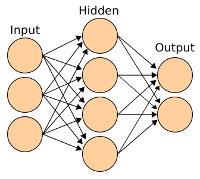
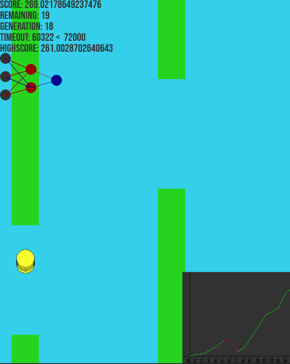

# Flappy Bird AI

## Overview
This project recreates the classic game "Flappy Bird" using the `pygame` library. The unique twist is the implementation of an artificial intelligence system for the birds within the game, giving them virtual brains.

## Neural Network Implementation
The birds' brains simulate real-life neuron connections through a neural network, a component of machine learning. [Learn more about Neural Networks](https://www.ibm.com/topics/neural-networks).

### Input Layer
The neural network takes three inputs from the game environment:
- Distance to the next pipe
- Distance to the bottom point of the top pipe
- Bird's velocity

These inputs undergo transformation using the sigmoid function, ensuring values are within the range of 0 to 1.

### Hidden Layer and Output Layer
Data proceeds to the hidden layer, where matrix multiplications occur based on genetic factors. The output layer performs additional computations, resulting in an output between 0 and 1. If the prediction exceeds 0.5, the bird executes a jump action.

## Genetic Algorithm
Each bird has a fitness variable representing its performance. After a bird's demise, genes from the best-performing bird are stored and transmitted to new birds with some mutations. The mutation multiplier adapts based on fitness, fostering learning and improvement over time.

## Result
