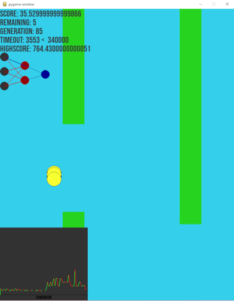

# Flappy Bird AI

## Description
Using the library `pygame`, I've recreated the game `Flappy bird`, keeping the core mechanics the same as in the original, but altering the bird functionality by giving it a virtual brain.

### The brain
The birds' brains work by trying to imitate real life neuron connections, using the branch of `Machine Learning` called `Neural Networks` ([More Information](https://www.ibm.com/topics/neural-networks)).

#### How do they work?
They take 3 inputs from the game environment (input layer):
- The distance to the next pipe
- The distance to the bottom point of the top pipe
- The bird's velocity

At first, we transform the input layer values in order to be 0 > a > 1 by applying the sigmoid function that we'll use for every node

After collection information from the environment, it passes on to the hidden layer where some matrix multiplications take place, depending on its genes.
The hidden layer then passes on to the output layer, where some other mathematic formulas are calculated, resulting in the output bein between 0 and 1. If this prediction is > 0.5, the bird jumps.

### Genetic Algorithm
Every bird has a variable called fitness, representing how good it is perfoming
After each bird has died, the genes from the best perfoming bird are stored, and then spread to some new birds with some mutations.
When the bird gets a very good fitness, the mutation multiplier decreases, and when the bird isn't good at all, the multiplier increases.
This results in the birds actually learning from each other and trying to perform better each time

### The result

